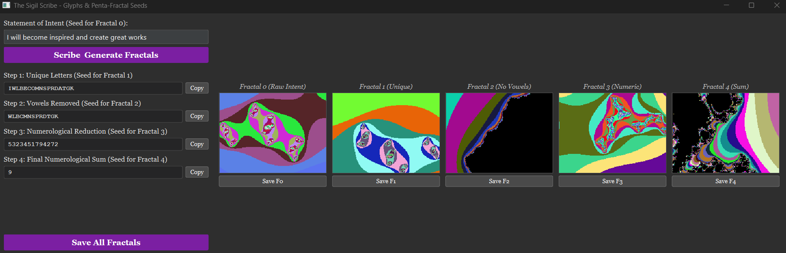

# The Sigil Scribe - Crafting Glyphs of Intent



The **Sigil Scribe** is a simple Python GUI application for processing textual statements of intent into various symbolic forms, inspired by Chaos Magick sigilization techniques. It helps transform an intent through letter removal, vowel stripping, and numerological reduction.

---

## ✨ Key Features

* **Intent Input:** Enter your textual statement of intent.
* **Multi-Step Processing:**
  1. **Unique Letters:** Removes duplicate letters, keeping order.  
  2. **Consonants Only:** Strips vowels from the previous result.  
  3. **Numerological Reduction (Per Letter):** Converts remaining letters to their alphabet number, then simplifies each to a single digit (e.g., K=11 → 2).  
  4. **Final Numerological Sum:** Sums all digits from step 3 and reduces this total to a final single digit.  
* **Copy to Clipboard:** Easily copy the result of each processing step.  
* **Thematic GUI:** Dark interface consistent with *The Chaos Engine* style.  

---

## 🚀 How to Use

1. **Run the Program:**
   * Save the script as `sigil_scribe.py`.
   * Open a terminal, navigate to its location, and run:  
     ```bash
     python sigil_scribe.py
     ```

2. **Using the GUI:**
   * **Statement of Intent:** Type your intent into the top text box.  
   * **Scribe the Sigil:** Click the purple button (or press Enter in the intent box) to process.  
   * **View Results:** The processed outputs for each step will appear below.  
   * **Copy:** Use the "Copy" buttons next to each result as needed.  

---

## 🔮 Connection to Chaos Magick

This tool aids in common sigilization methods by:

* **Abstracting Intent:** Progressively transforms the original statement, making it less recognizable to the conscious mind.  
* **Symbolic Reduction:** Converts linguistic intent into condensed letter-forms or numerological values.  
* **Providing Material for Sigil Craft:** Users can take any of the processed outputs as a basis for creating a visual sigil or for further meditative focus.  

---

> *Use to distill your will into potent symbolic forms.*
